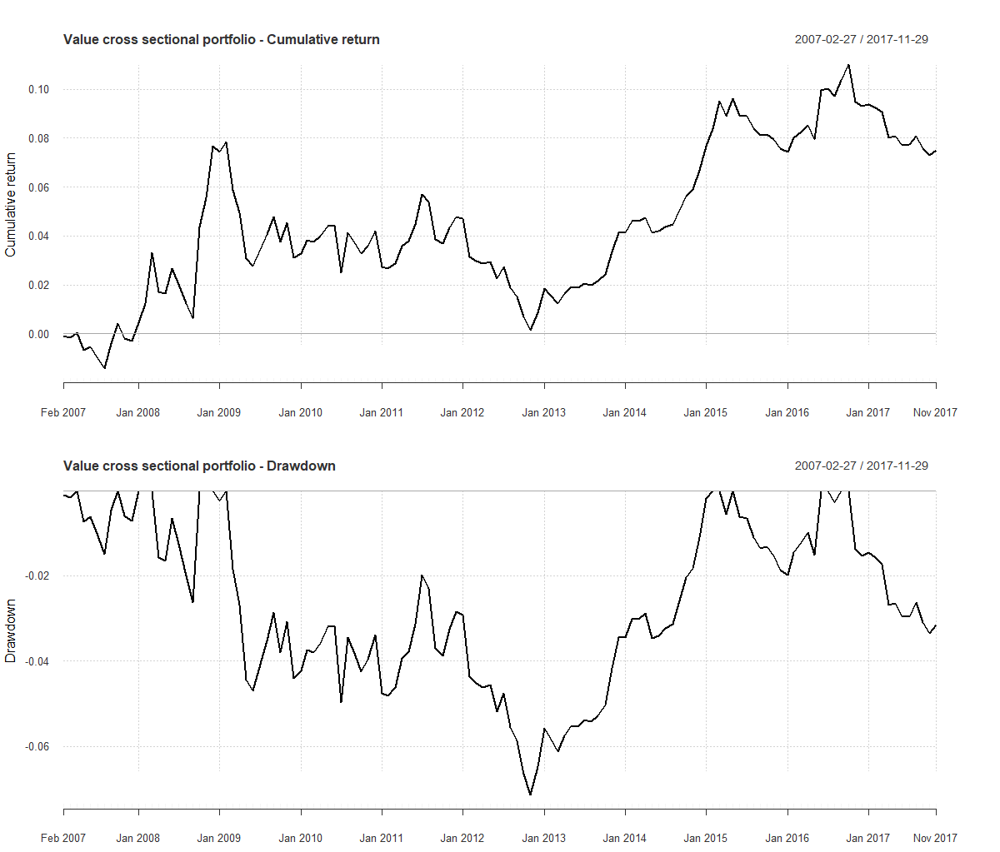

[](http://quantlet.de/)

## [](http://quantlet.de/) **ValueStrategyFX** [](http://quantlet.de/)

```yaml

Name of Quantlet : ValueStrategyFX

Description : 'Contains the Value strategy for the cross-sectional portfolio, which involves buying (selling) assets that 
are undervaluated (overvaluated) relative to a measure of fundamental value.  For our approach, we apply the algorithm presented 
by Baz et al. (2015) to generate the trading signal, based on the fundamental value represented by the real exchange rate. 
Based on the generated trading signals, we create the cross sectional portfolio.'

Keywords : 
 - fx trading
 - value portfolio
 - value arbitrage
 - real exchange rate 
 - Forex 

See also : 

Author : Joerg Osterrieder, Piotr Kotlarz 

Submitted :  Wed, 27 2019 by Joerg Osterrieder and Piotr Kotlarz 

Datafile : data.RData, ValueFunctions.R, ValuePackages.R, ValueStrategyFX.R

Example: 'Performance of cross sectional portfolio based on the value factor for 
EUR/USD, CAD/USD, CNY/USD, CZK/USD, JPY/USD, CHF/USD, GBP/USD and SEK/USD from 01-01-2006 to 01-12-2017 with monthly frequency.'
```



### R Code
```r

rm(list = ls(all = TRUE))

# please change your working directory setwd('C:/...')
# load the data, functions and packages 

source("ValuePackages.R")
source("ValueFunctions.R")

# Load the data 
load("data/data.RData")

# Specify parameters 
crncy = c("EUR", "CAD", "CNY", "CZK", "JPY", "CHF", "GBP", "SEK")
start_date = "2006-01-01"
end_date = "2017-12-01"

# Run backtest
Backtest = value_strategy(crncy = crncy, start_date = start_date, end_date = end_date)

# Generate plots 
par(mfrow=c(2,1))
chart.CumReturns(Backtest$portfolio, main = "Value cross sectional portfolio - Cumulative return")
title(ylab = "Cumulative return")
chart.Drawdown(Backtest$portfolio, main = "Value cross sectional portfolio - Drawdown")
title(ylab = "Drawdown") 


```

automatically created on 2019-02-26